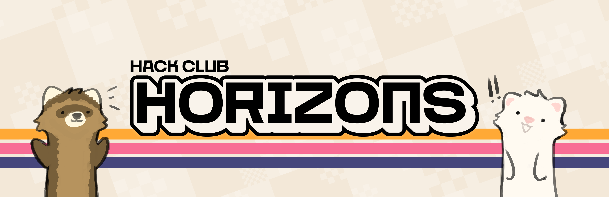

# Horizons



Horizons is a Hack Club program running a series of hackathons across the world during Summer 2026! This codebase is home to the foundational platform for Horizons and is built off of the previous Midnight codebase.

You can check it out [here](https://horizons.hackclub.com).

## Environment Variables

### Backend

See `backend/.env.example` for the required environment config

### Frontend / Admin
```env
PUBLIC_API_URL=http://localhost:3000/
PUBLIC_HACKATIME_CUTOFF_DATE=2026-02-21T00:00:00Z
PUBLIC_ENABLE_ONBOARDING=true
```

### Gateway
```env
PORT=3000
SERVICE_URL=http://localhost:3002       # Backend
UI_SERVICE_URL=http://localhost:5173    # Frontend
ADMIN_UI_SERVICE_URL=http://localhost:5174  # Admin
```

## Running Locally

```bash
# 1. Install dependencies
pnpm install

# 2. Generate Prisma client
pnpm --filter backend prisma:generate

# 3. Run database migrations. Requires DB to set up.
pnpm --filter backend prisma:migrate

# 4. Start all services concurrently
pnpm run dev
```

Open `http://localhost:3000` in your browser.